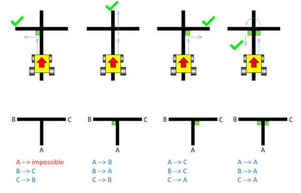
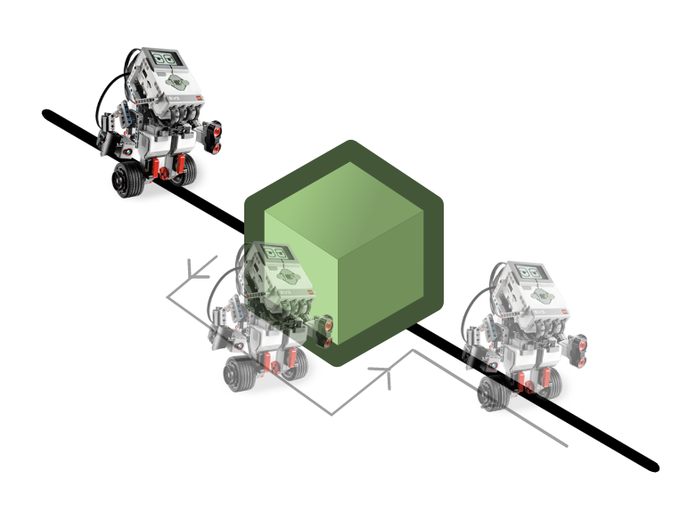
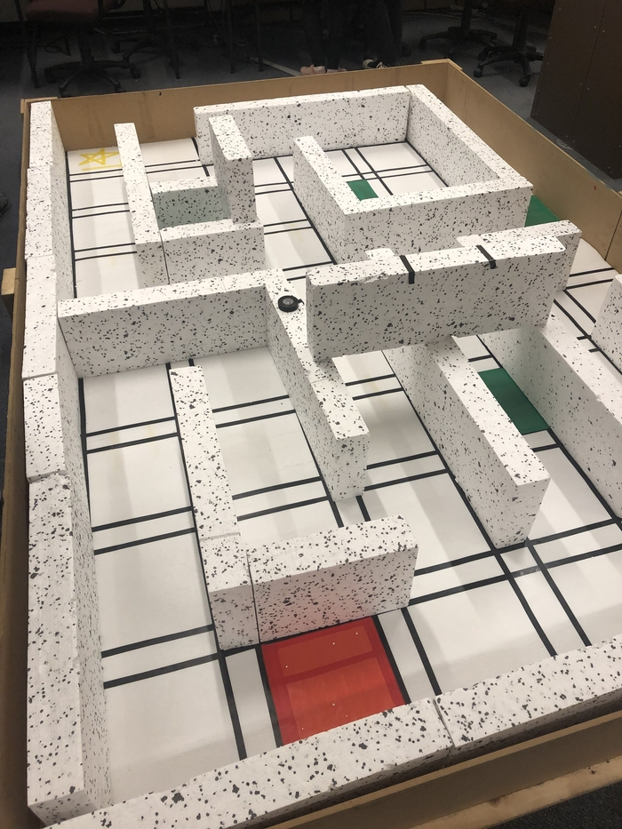
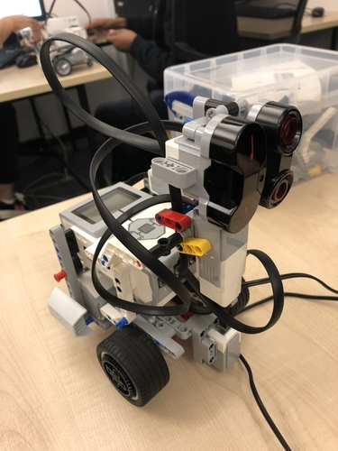
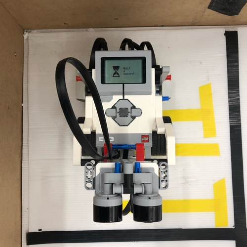
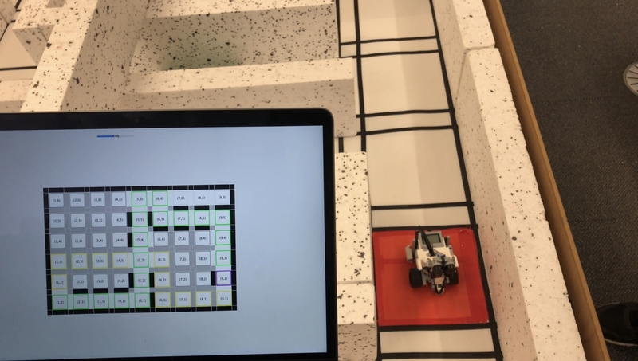

# Robotic EV3 Projects

Both the assisted and complete maze-solver programs are used to guide a [Lego Mindstorms EV3](https://education.lego.com/en-gb/product/mindstorms-ev3) through a maze system.

## Assisted Maze Solver

The assisted maze solver program was the first (marked) assignment we had using the robot.
The maze was just a grid of **black tape-lines** where the robot should follow the line and every possible occurance of intersection with **green tape as additional information** had a specified action so at the end the robot should have traversed the maze. Additionally if it detects an **object on the path** it should move around it and continue.

We used light and IR sensors to detect the lines (and their color) and objects respectively.

Our specifications were: 

## Complete Maze Solver

The complete maze solver is a vastly more complicated task. It was supposed to mimic an emergency robot mapping and traversing terrain to find an accident site and find the shortest path for medical help.

The specification file for the assignment was large but can be mostly summarized down to:

**General information:**

- The maze is only known after submission and can therefore not be hardcoded
- Green tiles must be handled as inpassable terrain (similar to walls)
- The tile in the corner with yellow tape is the starting point
- The red tile is the goal tile

**The Program:**

- Start
- Find the end tile
- Explore until the shortest path from end tile to start tile is found
- Move to the end tile
- Go back the shortest path to the start
- Terminate

**Additional specifications:**

- Travers the maze as fast as possible
- Display the map in some output (e.g. on the robot in text or over bluetooth as command output)

### The map

### Our robot

## Our live-updated map

